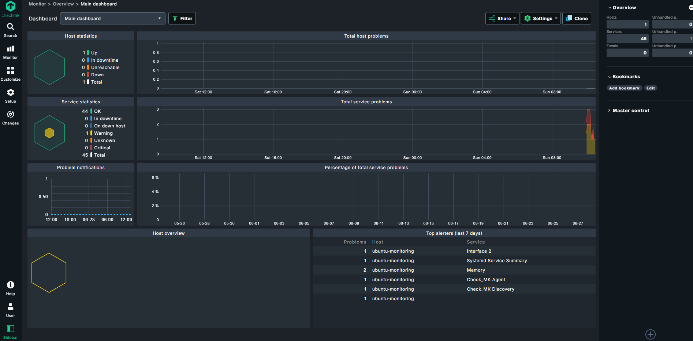
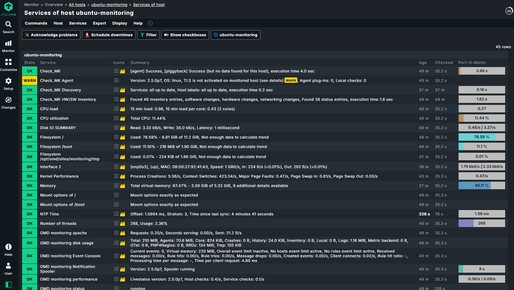

# Checkmk Monitoring Lab

Personal monitoring lab built on Ubuntu Server VM.

## Goals

- Learn Checkmk administration
- Monitor Linux services
- Monitor NGINX
- Explore monitoring plugins
- Practice Linux system administration

## Environment

- Ubuntu Server (26.04)
- Checkmk Raw
- NGINX
- VirtualBox

This repository is for learning and demonstrating Linux monitoring skills.

## Architecture

```text
Host Computer
┌──────────────────────────────┐
│ Windows 11                   │
│                              │
│  Oracle VirtualBox           │
│  ┌────────────────────────┐  │
│  │ Ubuntu Server 24.04    │  │
│  │                        │  │
│  │  ├── Checkmk server    │  │
│  │  │     └── Apache (:5000)
│  │  │
│  │  ├── Checkmk agent     │
│  │  │
│  │  └── nginx (:80)       │
│  └────────────────────────┘  │
└──────────────────────────────┘

Browser
      │
      ▼
http://<vm-ip>:5000/monitoring/check_mk/
```


## Example Screenshots

### Dashboard



### Services


