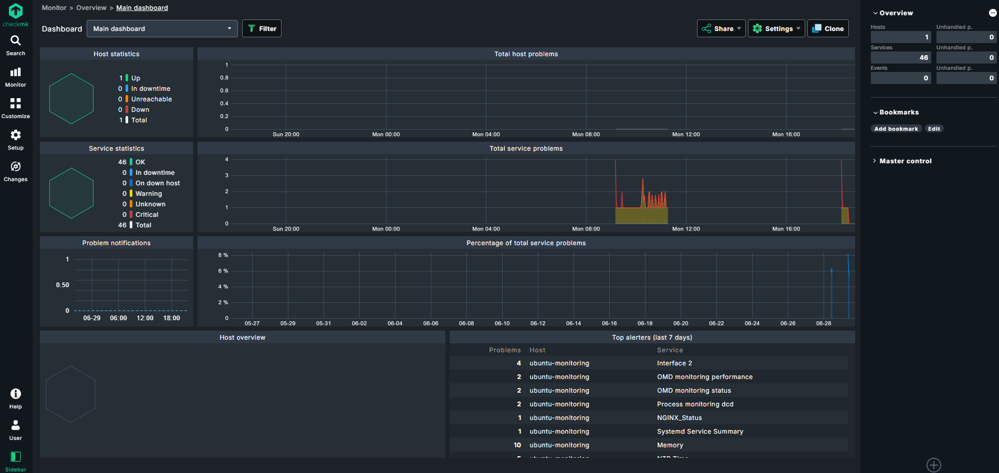

# Checkmk Monitoring Lab

Personal monitoring lab built on an Ubuntu Server VM. This repository documents a local infrastructure monitoring lab using Checkmk, Linux system services, NGINX, Apache reverse proxy, HTTPS, an internal lab CA and Checkmk Agent TLS.

## Goals

* Learn Checkmk administration and Linux host monitoring
* Practice service, resource and custom local check monitoring
* Configure HTTPS access with Apache reverse proxy and an internal CA
* Monitor HTTPS endpoint and certificate validity
* Configure Checkmk Agent TLS
* Practice Linux troubleshooting and system administration

## Environment

* Host OS: Windows 11
* Virtualization: Oracle VirtualBox
* Guest OS: Ubuntu Server 26.04
* Monitoring: Checkmk 2.5
* Web server: NGINX
* Reverse proxy: Apache
* Network mode: Bridged Adapter


## Architecture

```text
Host Computer
┌──────────────────────────────────────────────┐
│ Windows 11                                   │
│                                              │
│  Oracle VirtualBox                           │
│  ┌────────────────────────────────────────┐  │
│  │ Ubuntu Server 26.04                    │  │
│  │                                        │  │
│  │  ├── System Apache                     │  │
│  │  │     ├── HTTP  (:80)                 │  │
│  │  │     └── HTTPS (:443)                │  │
│  │  │          └── Reverse proxy          │  │
│  │  │              to Checkmk (:5000)     │  │
│  │  │                                     │  │
│  │  ├── Checkmk site Apache (:5000)       │  │
│  │  │                                     │  │
│  │  ├── Checkmk Agent                     │  │
│  │  │                                     │  │
│  │  └── NGINX (:8081)                     │  │
│  └────────────────────────────────────────┘  │
└──────────────────────────────────────────────┘

Browser
      │
      │ HTTPS
      ▼
https://<vm-ip>/monitoring/check_mk/
```

## Features

* Ubuntu Server VM setup with Bridged Adapter networking
* Checkmk server installation and Linux host monitoring
* System resource and service monitoring with Checkmk agent
* Custom NGINX monitoring using a Checkmk local check
* Apache HTTPS reverse proxy with an internal lab CA
* HTTPS endpoint and SSL certificate validity monitoring
* Checkmk Agent TLS registration

## Example Screenshots

### Dashboard



### Services


### NGINX Monitoring


## Troubleshooting Examples
* Changed VM networking from NAT to Bridged Adapter to make Checkmk access easier from the Windows host.
* Resolved an Apache and NGINX port conflict by moving NGINX from port `80` to `8081`.
* Enabled Apache auto-start after HTTPS access stopped working after VM reboot.
* Fixed an `UnknownIssuer` error by adding the internal lab Root CA to the Ubuntu trust store.
* Resolved an Agent TLS registration issue caused by an incorrect automation secret.

  
## Future Improvements
* Add another monitored Linux host
* Add more custom local checks
* Configure notification rules
* Add backup monitoring
* Add HTTP to HTTPS redirection
